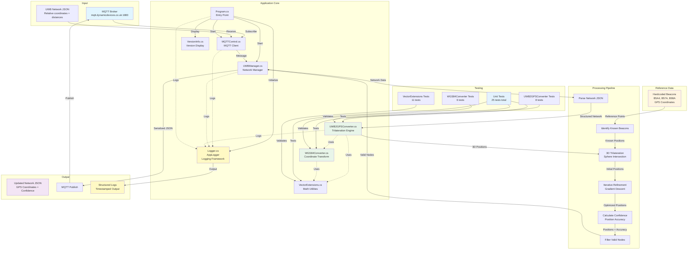

# Project Context: CGA Coordinate Mapping

## Project Overview

**Purpose**: Convert relative coordinates from Ultra-Wideband (UWB) devices into absolute GPS coordinates with confidence levels, using hardcoded beacon/tag locations as reference points.

**Status**: Active Development  
**Last Updated**: 2025-11-14  
**Repository**: `git@github.com:DynamicDevices/cga-coordinate-mapping.git`  
**License**: GPLv3 (see LICENSE file)

## Recent Updates (2025-11-14)

### Major Features Added
- ✅ **Logging Framework**: Replaced all `Console.WriteLine` with `Microsoft.Extensions.Logging`
  - Centralized `AppLogger` class for application-wide logging
  - Configurable log levels via `LOG_LEVEL` environment variable
  - Structured logging with parameters
  - Timestamped output
- ✅ **Unit Tests**: Comprehensive test suite with 25 tests
  - VectorExtensions tests (11 tests)
  - UWB2GPSConverter tests (8 tests)
  - WGS84Converter tests (6 tests)
  - Integrated into CI workflow
- ✅ **Semantic Versioning**: MAJOR.MINOR.PATCH versioning
  - Build date and git commit hash embedded in assembly
  - Version information displayed on startup
- ✅ **CI/CD Enhancements**: 
  - Test execution in CI pipeline
  - Linux x64 binary builds in addition to ARM64
  - Automated artifact publishing

### Bug Fixes & Improvements
- ✅ Fixed `isUpdating` flag bug - re-entrancy guard now works correctly
- ✅ Fixed `TryGetEndFromEdge` to check both `end0` and `end1` edge endpoints
- ✅ Fixed typo: `_usernname` → `_username` in MQTTControl.cs
- ✅ Added comprehensive null checks before processing network data
- ✅ Optimized neighbor lookups from O(n²) to O(n) using dictionary
- ✅ Fixed all build warnings (unused variables, async calls)
- ✅ Made `EdgeErrorSquared` public for unit testing

## Core Functionality

### Input
- **Relative coordinates** from UWB devices
- **Distance measurements** between UWB nodes (edges)
- **Hardcoded beacon locations** with known GPS coordinates (lat/lon/alt)
- Data received via **MQTT** in JSON format

### Processing
1. **Trilateration**: Calculate 3D positions of unknown nodes using distance measurements from known beacon positions
2. **Coordinate Transformation**: Convert local 3D coordinates to WGS84 GPS coordinates (latitude, longitude, altitude)
3. **Iterative Refinement**: Apply gradient descent optimization to improve position accuracy
4. **Confidence Calculation**: Compute position accuracy metrics based on distance measurement errors

### Output
- **Absolute GPS coordinates** (WGS84 lat/lon/alt) for all nodes
- **Confidence levels** (position accuracy in meters)
- **Updated network** with calculated positions, published back via MQTT

## Architecture

### Key Components

#### 1. MQTTControl.cs
- **Purpose**: MQTT client for bidirectional communication
- **Input**: Receives UWB network JSON from topic `DotnetMQTT/Test/in`
- **Output**: Publishes updated network with GPS coordinates to topic `DotnetMQTT/Test/out`
- **Configuration**: 
  - Server: `mqtt.dynamicdevices.co.uk:1883`
  - Client ID: `clientId-UwbManager-001`

#### 2. UWBManager.cs
- **Purpose**: Manages UWB network lifecycle and update pipeline
- **Responsibilities**:
  - Parse incoming MQTT messages into network structure
  - Trigger position calculations
  - Filter nodes with valid positions for output
  - Serialize and publish results
- **Thread Safety**: Re-entrancy protection via `isUpdating` flag to prevent concurrent updates
- **Error Handling**: Null checks before processing network data

#### 3. UWB2GPSConverter.cs
- **Purpose**: Core algorithm implementation
- **Algorithms**:
  - **3D Trilateration**: Calculates positions from 3+ known reference points
  - **Iterative Refinement**: Gradient descent optimization (max 10 iterations, learning rate 0.1)
  - **Error Calculation**: Computes position accuracy based on distance constraint violations
- **Performance**: Uses `Dictionary<string, UWB>` for O(1) neighbor lookups (optimized from O(n²))
- **Edge Handling**: `TryGetEndFromEdge` correctly handles both `end0` and `end1` edge endpoints
- **Requirements**: Minimum 3 beacons with `positionKnown: true` and valid GPS coordinates

#### 4. WGS84Converter.cs
- **Purpose**: Geodetic coordinate transformations
- **Transformations**:
  - Local 3D coordinates → ECEF (Earth-Centered, Earth-Fixed)
  - ECEF → WGS84 GPS (lat/lon/alt)
  - ENU (East-North-Up) tangent plane calculations
  - Unity coordinate system conversions
- **Reference**: Based on WGS84 ellipsoid constants (a=6378.137 km, f=1/298.257223563)

#### 5. VectorExtensions.cs
- **Purpose**: Vector math utilities
- **Operations**: Normalization, cross product, dot product, distance calculations

#### 6. Logger.cs (AppLogger)
- **Purpose**: Centralized logging infrastructure
- **Framework**: Microsoft.Extensions.Logging
- **Features**:
  - Console output with timestamps
  - Configurable log levels (Trace, Debug, Information, Warning, Error, Critical)
  - Environment variable configuration: `LOG_LEVEL`
  - Structured logging with parameters
  - Default log level: Information

#### 7. VersionInfo.cs
- **Purpose**: Version information display
- **Data**: Semantic version, build date, git commit hash
- **Source**: Assembly metadata injected at build time

#### 8. UwbParser.py
- **Purpose**: Preprocessing tool for edge data
- **Function**: Converts edge list format to network JSON structure
- **Beacon Configuration**: Hardcoded beacon positions for B5A4, B57A, B98A

## System Architecture Diagram

> **⚠️ Important**: This diagram must be kept updated as the code changes. When modifying components, data flow, or architecture, update this diagram accordingly.



## Data Flow

```
MQTT Message (JSON)
    ↓
UWBManager.UpdateUwbsFromMessage()
    ↓
Parse Network Structure
    ↓
UWB2GPSConverter.ConvertUWBToPositions()
    ↓
1. Identify 3+ Known Beacons (hardcoded GPS positions)
    ↓
2. Trilateration Loop:
   - For each unknown node
   - Find 3 known neighbors
   - Calculate 3D position using sphere intersection
   - Convert to GPS using WGS84Converter
    ↓
3. Iterative Refinement:
   - Gradient descent optimization
   - Minimize distance error
   - Update positions
    ↓
4. Calculate Confidence:
   - Position accuracy = sqrt(mean squared error)
   - Based on distance constraint violations
    ↓
Filter Valid Nodes (latLonAlt != null, accuracy != -1)
    ↓
Serialize to JSON
    ↓
MQTT Publish
```

## Hardcoded Beacon Locations

The system relies on **hardcoded beacon/tag locations** with known GPS coordinates:

| Beacon ID | Latitude | Longitude | Altitude (m) |
|-----------|----------|-----------|--------------|
| B5A4      | 53.48514639104522 | -2.191785053920114 | 0.0 |
| B57A      | 53.48545891792991 | -2.19232588314793 | 0.0 |
| B98A      | 53.485994341662628 | -2.192366069038485 | 0.0 |

**Location**: Manchester, UK area (approximately)

These beacons serve as **reference points** for the trilateration algorithm. All other node positions are calculated relative to these fixed points.

## Algorithm Details

### Trilateration Process

1. **Initial Setup**:
   - Identify all nodes with `positionKnown: true` (beacons)
   - Verify at least 3 beacons exist
   - Convert beacon GPS coordinates to local 3D space using WGS84 transformations

2. **Position Calculation**:
   - For each unknown node:
     - Find 3 known neighbors (beacons or previously calculated nodes)
     - Extract distance measurements from edges
     - Calculate sphere intersection in 3D space
     - Handle collinear cases (error if nodes are too close/collinear)

3. **Coordinate Conversion**:
   - Use reference beacon's GPS position as origin
   - Transform calculated 3D offset to GPS coordinates
   - Apply WGS84 ellipsoid corrections

4. **Refinement**:
   - Iterative gradient descent (up to 10 iterations)
   - Adjust positions to minimize distance measurement errors
   - Only accept improvements (reject if error increases)

### Confidence Calculation

**Position Accuracy** (`positionAccuracy`):
- Calculated as: `sqrt(mean_squared_error)`
- Where error = `|calculated_distance - measured_distance|` for each edge
- Units: meters
- Value of `-1` indicates invalid/uncalculated position

**Factors Affecting Confidence**:
- Number of distance measurements (edges)
- Geometric distribution of reference nodes
- Distance measurement accuracy
- Convergence of refinement algorithm

## Current Implementation Status

### ✅ Completed
- MQTT integration (receive/publish)
- Trilateration algorithm (3D sphere intersection)
- WGS84 coordinate conversion
- Iterative refinement (gradient descent)
- Confidence/accuracy calculation
- ARM64 native build support
- Linux x64 native build support
- CI/CD pipeline (GitHub Actions)
- Python preprocessing script
- Re-entrancy protection (isUpdating flag)
- Robust null checking and error handling
- Optimized O(n) neighbor lookups using dictionary
- Edge endpoint resolution (handles both end0 and end1)
- **Logging framework** (Microsoft.Extensions.Logging)
- **Unit tests** (25 tests covering core functionality)
- **Semantic versioning** (with build date and git commit hash)
- **Test execution in CI** (automated test runs)

### 🔄 Future Improvements
- Configuration file support (appsettings.json)
- Retry logic for MQTT connections
- Health check endpoint
- Metrics/monitoring
- Support for dynamic beacon configuration (not just hardcoded)
- Additional unit test coverage for edge cases
- Integration tests for MQTT communication

## Build & Deployment

### Target Platform
- **Primary**: Linux ARM64 (embedded systems)
- **Build Tool**: .NET 8.0 SDK
- **CI/CD**: GitHub Actions (automated builds on push)

### Build Artifacts
- Native ARM64 executable: `InstDotNet`
- Managed assembly: `InstDotNet.dll`
- Dependencies: `MQTTnet.dll`
- Runtime config: `InstDotNet.runtimeconfig.json`

### Deployment
1. Download artifact from GitHub Actions
2. Extract to target system
3. Ensure .NET 8.0 runtime is installed (for framework-dependent build)
4. Configure MQTT broker connection (if different from defaults)
5. Run: `./InstDotNet`

## Testing

### Unit Tests
- **Test Framework**: xUnit
- **Test Project**: `tests/InstDotNet.Tests/`
- **Coverage**: 25 tests total
  - **VectorExtensionsTests** (11 tests): Vector math operations
  - **UWB2GPSConverterTests** (8 tests): Edge handling and error calculations
  - **WGS84ConverterTests** (6 tests): Coordinate conversion and length calculations
- **CI Integration**: Tests run automatically in GitHub Actions
- **Run Tests Locally**: `dotnet test`

### Test Data
- **TestNodes.json**: Sample network with 10 nodes
  - 3 beacons (B5A4, B57A, B98A) with known positions
  - 7 unknown nodes with distance measurements
  - Various triage statuses for emergency response scenarios

### Manual Testing
1. Start MQTT broker
2. Run application
3. Publish test network JSON to receive topic
4. Verify GPS coordinates calculated for unknown nodes
5. Check confidence levels in output
6. Review structured logs for debugging

## Related Files

- `README.md`: User-facing documentation
- `LICENSE`: GPLv3 license text
- `TestNodes.json`: Sample test data
- `.github/workflows/ci.yml`: CI/CD pipeline
- `UwbParser.py`: Data preprocessing tool
- `tests/InstDotNet.Tests/`: Unit test project

## Notes

- **Coordinate System**: Uses Unity-style coordinate system internally (Y-up), converts to ENU (East-North-Up) for GPS
- **Distance Units**: All distances in meters
- **Update Frequency**: 10ms update loop (configurable in `Program.cs`)
- **Error Handling**: Comprehensive null checks and structured error logging, continues on failures
- **Logging**: Configurable via `LOG_LEVEL` environment variable (Trace, Debug, Information, Warning, Error, Critical)
- **Thread Safety**: Re-entrancy protection via `isUpdating` flag (volatile trigger flag for thread-safe updates)
- **Performance**: Optimized neighbor lookups using Dictionary<string, UWB> for O(1) access instead of O(n) linear search
- **Versioning**: Semantic versioning (MAJOR.MINOR.PATCH) with build metadata (date, git commit hash)
- **License**: GPLv3 - See LICENSE file for full terms

## Contact & Maintenance

- **Repository**: DynamicDevices/cga-coordinate-mapping
- **Initial Development**: CGA
- **Maintenance**: [To be assigned]

---

*This document should be updated as the project evolves. Key changes should be documented here for team reference.*

