# Project Context: CGA Coordinate Mapping

## Project Overview

**Purpose**: Convert relative coordinates from Ultra-Wideband (UWB) devices into absolute GPS coordinates with confidence levels, using known beacon/tag locations (provided via configuration or MQTT data) as reference points.

**Status**: Active Development  
**Last Updated**: 2025-11-14  
**Version**: 1.1.0  
**Latest Release**: [v1.1.0](https://github.com/DynamicDevices/cga-coordinate-mapping/releases/tag/v1.1.0) (2025-11-14)  
**Repository**: `git@github.com:DynamicDevices/cga-coordinate-mapping.git`  
**License**: GPLv3 (see LICENSE file)

## Recent Updates (2025-11-14)

### Major Features Added
- ✅ **Logging Framework**: Replaced all `Console.WriteLine` with `Microsoft.Extensions.Logging`
  - Centralized `AppLogger` class for application-wide logging
  - Configurable log levels via `LOG_LEVEL` environment variable or `appsettings.json`
  - Structured logging with parameters
  - Timestamped output
- ✅ **Unit Tests**: Comprehensive test suite with **92 tests** (all passing)
  - VectorExtensions tests (11 tests)
  - UWB2GPSConverter tests (8 tests)
  - WGS84Converter tests (6 tests)
  - AppConfig tests (6 tests)
  - AppLogger tests (7 tests)
  - VersionInfo tests (6 tests)
  - Trilateration tests (13 tests)
  - Integrated into CI workflow with automated test execution
- ✅ **Semantic Versioning**: MAJOR.MINOR.PATCH versioning
  - Build date and git commit hash embedded in assembly
  - Version information displayed on startup
- ✅ **CI/CD Enhancements**: 
  - ✅ **CI Pipeline Fully Working**: All tests pass (92/92)
  - Simplified, reliable CI workflow with proper dependency restoration
  - Test execution in CI pipeline for both linux-arm64 and linux-x64
  - Linux x64 binary builds in addition to ARM64
  - Automated artifact publishing
  - Fixed test framework configuration (explicit using statements)
  - Stable, production-ready CI pipeline
- ✅ **Configuration Management**: 
  - `appsettings.json` support for MQTT, application, and algorithm settings
  - Dynamic beacon configuration from configuration file (optional)
  - **Beacon support from MQTT data** - beacons can be provided dynamically via MQTT messages
  - Environment variable overrides
- ✅ **MQTT Resilience**:
  - Exponential backoff retry logic for initial connection
  - Automatic reconnection on disconnect
  - Configurable retry attempts and delays

### Bug Fixes & Improvements
- ✅ Fixed `isUpdating` flag bug - re-entrancy guard now works correctly
- ✅ Fixed `TryGetEndFromEdge` to check both `end0` and `end1` edge endpoints
- ✅ Fixed typo: `_usernname` → `_username` in MQTTControl.cs
- ✅ Added comprehensive null checks before processing network data
- ✅ Optimized neighbor lookups from O(n²) to O(n) using dictionary
- ✅ Fixed all build warnings (unused variables, async calls)
- ✅ Made `EdgeErrorSquared` public for unit testing
- ✅ Fixed CI test isolation issues (logger disposal handling)
- ✅ Fixed CI workflow - simplified restore/build/test process
- ✅ Fixed test framework includes - explicit `using Xunit;` in all test files
- ✅ Added ObjectDisposedException handling in UWB2GPSConverter for test robustness
- ✅ Stable CI pipeline - all builds and tests passing reliably

## Core Functionality

### Input
- **Relative coordinates** from UWB devices
- **Distance measurements** between UWB nodes (edges)
- **Hardcoded beacon locations** with known GPS coordinates (lat/lon/alt)
- Data received via **MQTT** in JSON format

### Processing
1. **Trilateration**: Calculate 3D positions of unknown nodes using distance measurements from known beacon positions
2. **Coordinate Transformation**: Convert local 3D coordinates to WGS84 GPS coordinates (latitude, longitude, altitude)
3. **Iterative Refinement**: Apply gradient descent optimization to improve position accuracy
4. **Confidence Calculation**: Compute position accuracy metrics based on distance measurement errors

### Output
- **Absolute GPS coordinates** (WGS84 lat/lon/alt) for all nodes
- **Confidence levels** (position accuracy in meters)
- **Updated network** with calculated positions, published back via MQTT

## Architecture

### Key Components

#### 1. src/MQTTControl.cs
- **Purpose**: MQTT client for bidirectional communication
- **Input**: Receives UWB network JSON from topic `DotnetMQTT/Test/in`
- **Output**: Publishes updated network with GPS coordinates to topic `DotnetMQTT/Test/out`
- **Configuration**: Loaded from `appsettings.json` (configurable server, port, topics, credentials)
- **Features**: Automatic retry logic with exponential backoff, auto-reconnection on disconnect

#### 2. src/UWBManager.cs
- **Purpose**: Manages UWB network lifecycle and update pipeline
- **Responsibilities**:
  - Parse incoming MQTT messages into network structure
  - Trigger position calculations
  - Filter nodes with valid positions for output
  - Serialize and publish results
- **Thread Safety**: Re-entrancy protection via `isUpdating` flag to prevent concurrent updates
- **Error Handling**: Null checks before processing network data

#### 3. src/UWB2GPSConverter.cs
- **Purpose**: Core algorithm implementation
- **Algorithms**:
  - **3D Trilateration**: Calculates positions from 3+ known reference points
  - **Iterative Refinement**: Gradient descent optimization (max 10 iterations, learning rate 0.1)
  - **Error Calculation**: Computes position accuracy based on distance constraint violations
- **Performance**: Uses `Dictionary<string, UWB>` for O(1) neighbor lookups (optimized from O(n²))
- **Edge Handling**: `TryGetEndFromEdge` correctly handles both `end0` and `end1` edge endpoints
- **Requirements**: Minimum 3 beacons with `positionKnown: true` and valid GPS coordinates

#### 4. src/WGS84Converter.cs
- **Purpose**: Geodetic coordinate transformations
- **Transformations**:
  - Local 3D coordinates → ECEF (Earth-Centered, Earth-Fixed)
  - ECEF → WGS84 GPS (lat/lon/alt)
  - ENU (East-North-Up) tangent plane calculations
  - Unity coordinate system conversions
- **Reference**: Based on WGS84 ellipsoid constants (a=6378.137 km, f=1/298.257223563)

#### 5. src/VectorExtensions.cs
- **Purpose**: Vector math utilities
- **Operations**: Normalization, cross product, dot product, distance calculations

#### 6. src/InstDotNet/Logger.cs (AppLogger)
- **Purpose**: Centralized logging infrastructure
- **Framework**: Microsoft.Extensions.Logging
- **Features**:
  - Console output with timestamps
  - Configurable log levels (Trace, Debug, Information, Warning, Error, Critical)
  - Environment variable configuration: `LOG_LEVEL`
  - Structured logging with parameters
  - Default log level: Information

#### 7. src/VersionInfo.cs
- **Purpose**: Version information display
- **Data**: Semantic version, build date, git commit hash
- **Source**: Assembly metadata injected at build time

#### 8. src/AppConfig.cs
- **Purpose**: Configuration model and loader
- **Features**: 
  - Loads from `appsettings.json` and `appsettings.Development.json`
  - Supports environment variable overrides
  - Validates and binds configuration to strongly-typed models
  - Provides defaults if configuration files are missing

#### 9. UwbParser.py (root directory)
- **Purpose**: Preprocessing tool for edge data
- **Function**: Converts edge list format to network JSON structure
- **Beacon Configuration**: Hardcoded beacon positions for B5A4, B57A, B98A

## System Architecture Diagram

> **⚠️ Important**: This diagram must be kept updated as the code changes. When modifying components, data flow, or architecture, update this diagram accordingly.

```mermaid
graph TB
    subgraph "Input"
        MQTT[MQTT Broker<br/>mqtt.dynamicdevices.co.uk:1883]
        JSON[UWB Network JSON<br/>Relative coordinates + distances]
    end
    
    subgraph "Application Core (src/)"
        Program[Program.cs<br/>Entry Point]
        MQTTCtrl[MQTTControl.cs<br/>MQTT Client]
        UWBManager[UWBManager.cs<br/>Network Manager]
        Converter[UWB2GPSConverter.cs<br/>Trilateration Engine]
        WGS84[WGS84Converter.cs<br/>Coordinate Transform]
        Vector[VectorExtensions.cs<br/>Math Utilities]
        Logger[Logger.cs<br/>AppLogger<br/>Logging Framework]
        Version[VersionInfo.cs<br/>Version Display]
        Config[AppConfig.cs<br/>Configuration Loader]
    end
    
    subgraph "Reference Data"
        Beacons[Beacons<br/>From appsettings.json<br/>OR MQTT Data<br/>GPS Coordinates]
    end
    
    subgraph "Processing Pipeline"
        Parse[Parse Network JSON]
        Identify[Identify Known Beacons]
        Trilat[3D Trilateration<br/>Sphere Intersection]
        Refine[Iterative Refinement<br/>Gradient Descent]
        CalcConf[Calculate Confidence<br/>Position Accuracy]
        Filter[Filter Valid Nodes]
    end
    
    subgraph "Testing"
        Tests[Unit Tests<br/>92 tests total<br/>All passing ✅]
        VectorTests[VectorExtensions Tests<br/>11 tests]
        ConverterTests[UWB2GPSConverter Tests<br/>8 tests]
        WGS84Tests[WGS84Converter Tests<br/>6 tests]
        ConfigTests[AppConfig Tests<br/>6 tests]
        LoggerTests[AppLogger Tests<br/>7 tests]
        VersionTests[VersionInfo Tests<br/>6 tests]
        TrilatTests[Trilateration Tests<br/>13 tests]
    end
    
    subgraph "Output"
        OutputJSON[Updated Network JSON<br/>GPS Coordinates + Confidence]
        MQTTOut[MQTT Publish]
        Logs[Structured Logs<br/>Timestamped Output]
    end
    
    MQTT -->|Subscribe| MQTTCtrl
    JSON -->|Receive| MQTTCtrl
    Program -->|Initialize| Logger
    Program -->|Display| Version
    Program -->|Start| MQTTCtrl
    Program -->|Start| UWBManager
    MQTTCtrl -->|Message| UWBManager
    UWBManager -->|Network Data| Parse
    Parse -->|Structured Network| Converter
    Beacons -->|Reference Points| Identify
    Identify -->|Known Positions| Trilat
    Converter -->|3D Positions| Trilat
    Trilat -->|Initial Positions| Refine
    Refine -->|Optimized Positions| CalcConf
    CalcConf -->|Positions + Accuracy| Filter
    Filter -->|Valid Nodes| UWBManager
    UWBManager -->|Serialized JSON| MQTTOut
    MQTTOut -->|Publish| MQTT
    
    Converter -.->|Uses| WGS84
    Converter -.->|Uses| Vector
    WGS84 -.->|Uses| Vector
    MQTTCtrl -.->|Logs| Logger
    UWBManager -.->|Logs| Logger
    Converter -.->|Logs| Logger
    Program -.->|Logs| Logger
    
    Tests -->|Tests| Vector
    Tests -->|Tests| Converter
    Tests -->|Tests| WGS84
    Tests -->|Tests| Config
    Tests -->|Tests| Logger
    Tests -->|Tests| Version
    VectorTests -->|Validates| Vector
    ConverterTests -->|Validates| Converter
    WGS84Tests -->|Validates| WGS84
    ConfigTests -->|Validates| Config
    LoggerTests -->|Validates| Logger
    VersionTests -->|Validates| Version
    TrilatTests -->|Validates| Converter
    
    Logger -->|Output| Logs
    
    style MQTT fill:#e1f5ff
    style Beacons fill:#fff4e1
    style Converter fill:#e8f5e9
    style WGS84 fill:#e8f5e9
    style Logger fill:#fff9c4
    style Tests fill:#e3f2fd
    style OutputJSON fill:#f3e5f5
    style Logs fill:#fff9c4
```



## Data Flow

```
MQTT Message (JSON)
    ↓
UWBManager.UpdateUwbsFromMessage()
    ↓
Parse Network Structure
    ↓
UWB2GPSConverter.ConvertUWBToPositions()
    ↓
1. Identify 3+ Known Beacons (from config or MQTT data)
    ↓
2. Trilateration Loop:
   - For each unknown node
   - Find 3 known neighbors
   - Calculate 3D position using sphere intersection
   - Convert to GPS using WGS84Converter
    ↓
3. Iterative Refinement:
   - Gradient descent optimization
   - Minimize distance error
   - Update positions
    ↓
4. Calculate Confidence:
   - Position accuracy = sqrt(mean squared error)
   - Based on distance constraint violations
    ↓
Filter Valid Nodes (latLonAlt != null, accuracy != -1)
    ↓
Serialize to JSON
    ↓
MQTT Publish
```

## Beacon Configuration

The system supports **two methods** for providing beacon locations:

### 1. Configuration File (Optional)
Beacons can be pre-configured in `appsettings.json`:
```json
"Beacons": [
  {
    "Id": "B5A4",
    "Latitude": 53.48514639104522,
    "Longitude": -2.191785053920114,
    "Altitude": 0.0
  }
]
```

### 2. MQTT Data (Recommended)
Beacons can be provided dynamically via MQTT messages. Nodes with `positionKnown: true` and valid `latLonAlt` coordinates are automatically recognized as beacons:

```json
{
  "uwbs": [
    {
      "id": "B5A4",
      "positionKnown": true,
      "latLonAlt": [53.48514639104522, -2.191785053920114, 0.0],
      "edges": []
    }
  ]
}
```

**Default Configuration**: The `appsettings.json` file has an empty `Beacons` array by default, expecting beacons to be provided via MQTT data.

**Reference Point**: The first node with `positionKnown = true` and valid `latLonAlt` becomes the reference point (origin at 0,0,0 in local 3D space). All other positions are calculated relative to this reference.

**Requirements**: At least 3 beacons are required for trilateration. These can come from configuration, MQTT data, or a combination of both.

## Algorithm Details

### Trilateration Process

1. **Initial Setup**:
   - Identify all nodes with `positionKnown: true` (beacons from configuration or MQTT data)
   - Verify at least 3 beacons exist
   - Find first known node to use as reference point
   - Convert all beacon GPS coordinates to local 3D space using WGS84 transformations

2. **Position Calculation**:
   - For each unknown node:
     - Find 3 known neighbors (beacons or previously calculated nodes)
     - Extract distance measurements from edges
     - Calculate sphere intersection in 3D space
     - Handle collinear cases (error if nodes are too close/collinear)

3. **Coordinate Conversion**:
   - Use first known node's GPS position as origin (reference point)
   - Transform calculated 3D offset to GPS coordinates
   - Apply WGS84 ellipsoid corrections

4. **Refinement**:
   - Iterative gradient descent (up to 10 iterations)
   - Adjust positions to minimize distance measurement errors
   - Only accept improvements (reject if error increases)

### Confidence Calculation

**Position Accuracy** (`positionAccuracy`):
- Calculated as: `sqrt(mean_squared_error)`
- Where error = `|calculated_distance - measured_distance|` for each edge
- Units: meters
- Value of `-1` indicates invalid/uncalculated position

**Factors Affecting Confidence**:
- Number of distance measurements (edges)
- Geometric distribution of reference nodes
- Distance measurement accuracy
- Convergence of refinement algorithm

## Current Implementation Status

### ✅ Completed
- MQTT integration (receive/publish)
- Trilateration algorithm (3D sphere intersection)
- WGS84 coordinate conversion
- Iterative refinement (gradient descent)
- Confidence/accuracy calculation
- ARM64 native build support
- Linux x64 native build support
- CI/CD pipeline (GitHub Actions)
- Python preprocessing script
- Re-entrancy protection (isUpdating flag)
- Robust null checking and error handling
- Optimized O(n) neighbor lookups using dictionary
- Edge endpoint resolution (handles both end0 and end1)
- **Logging framework** (Microsoft.Extensions.Logging)
- **Unit tests** (92 tests covering core functionality - all passing ✅)
- **Semantic versioning** (with build date and git commit hash)
- **Test execution in CI** (automated test runs for both platforms)
- **Configuration file support** (appsettings.json with environment variable overrides)
- **MQTT retry and auto-reconnect** (exponential backoff, configurable retry logic)
- **Dynamic beacon configuration** (beacons loaded from appsettings.json)

### 🔄 Future Improvements
- ✅ Configuration file support (appsettings.json) - **COMPLETED**
- ✅ Retry logic for MQTT connections - **COMPLETED**
- ✅ Support for dynamic beacon configuration - **COMPLETED**
- ✅ Support for beacons from MQTT data - **COMPLETED**
- Health check endpoint
- Metrics/monitoring
- Additional unit test coverage for edge cases (see CODE_COVERAGE_IMPROVEMENTS.md)
- Integration tests for MQTT communication (see CODE_COVERAGE_IMPROVEMENTS.md)

## Build & Deployment

### ⚠️ CRITICAL: CI Configuration Stability

**🚨 DO NOT CHANGE THE CI WORKFLOW - IT IS WORKING CORRECTLY 🚨**

**The CI is currently working and all tests pass. Any changes to `.github/workflows/ci.yml` risk breaking the build pipeline. Only modify if absolutely necessary and after extensive local testing.**

The CI workflow (`.github/workflows/ci.yml`) has been simplified for maximum reliability. The current working configuration uses:

1. **Restore solution** (`dotnet restore InstDotNet.sln`) - Restores all packages once
2. **Build main project** (`dotnet build --no-restore -r runtime`) - Builds with runtime identifier
3. **Build test project** (`dotnet build --no-restore`) - Builds test project
4. **Run tests** (`dotnet test --no-build`) - Runs tests without rebuilding

**Why this is reliable:**
- Single restore step ensures all packages are available
- `--no-restore` flags prevent redundant restore operations
- `--no-build` flag on test prevents redundant builds
- Minimal steps reduce chance of race conditions or timing issues
- All steps in one script block for atomic execution

**Before modifying CI:**
- Test locally with the exact same commands
- Verify all 92 tests pass
- Check that both linux-arm64 and linux-x64 builds work
- Review git history for previous working configurations

**Current stable configuration:** Commit 2b78f6b (2025-11-14)

**Known Issue - Intermittent Test Failures:**
- Tests may fail intermittently due to race conditions with static state
- Static state includes: `AppLogger`, `MQTTControl.OnMessageReceived`, `UWB2GPSConverter._configuredBeacons`
- **Fix applied**: Disabled parallel test execution (`xUnitDisableParallelTestExecution=true`) to ensure test isolation
- All test classes that modify static state use `[Collection("LoggerTests")]` to run sequentially
- If CI fails intermittently, check for test isolation issues first

**⚠️ IMPORTANT: This CI configuration is working correctly. DO NOT modify it unless there is a critical need. The CI has been broken multiple times in the past by unnecessary changes. If you must modify it:**
1. Test locally with the exact same commands first
2. Verify all 92 tests pass locally
3. Test both linux-arm64 and linux-x64 builds locally
4. Only then commit and push
5. Monitor the CI run closely after pushing

### Target Platform
- **Primary**: Linux ARM64 (embedded systems)
- **Build Tool**: .NET 8.0 SDK
- **CI/CD**: GitHub Actions (automated builds on push)

### Build Artifacts
- Native ARM64 executable: `InstDotNet`
- Managed assembly: `InstDotNet.dll`
- Dependencies: `MQTTnet.dll`
- Runtime config: `InstDotNet.runtimeconfig.json`

### Deployment
1. Download artifact from GitHub Actions
2. Extract to target system
3. Ensure .NET 8.0 runtime is installed (for framework-dependent build)
4. Configure MQTT broker connection (if different from defaults)
5. Run: `./InstDotNet`

## Testing

### Unit Tests
- **Test Framework**: xUnit
- **Test Project**: `tests/InstDotNet.Tests/`
- **Coverage**: **92 tests total** (all passing ✅)
  - **VectorExtensionsTests** (11 tests): Vector math operations
  - **UWB2GPSConverterTests** (8 tests): Edge handling and error calculations
  - **WGS84ConverterTests** (6 tests): Coordinate conversion and length calculations
  - **AppConfigTests** (7 tests): Configuration loading and validation
  - **AppLoggerTests** (9 tests): Logging framework initialization and log level parsing
  - **VersionInfoTests** (6 tests): Version information retrieval
  - **TrilaterationTests** (10 tests): Core trilateration algorithm, beacon initialization, refinement
  - **HardwareIdTests** (14 tests): Hardware ID generation and MQTT client ID sanitization
  - **MQTTControlTests** (11 tests): Message handling, event subscription, constants
  - **UWBManagerTests** (10 tests): Initialization, message parsing, update logic
- **CI Integration**: Tests run automatically in GitHub Actions for both linux-arm64 and linux-x64
- **Test Status**: All 92 tests passing in CI ✅
- **Code Coverage**: 53.1% line coverage, 40.6% branch coverage
- **Run Tests Locally**: `dotnet test`

### Test Data
- **TestNodes.json**: Sample network with 10 nodes
  - 3 beacons (B5A4, B57A, B98A) with known positions
  - 7 unknown nodes with distance measurements
  - Various triage statuses for emergency response scenarios

### Manual Testing
1. Start MQTT broker
2. Run application
3. Publish test network JSON to receive topic
4. Verify GPS coordinates calculated for unknown nodes
5. Check confidence levels in output
6. Review structured logs for debugging

## Related Files

- `README.md`: User-facing documentation
- `LICENSE`: GPLv3 license text
- `TestNodes.json`: Sample test data
- `.github/workflows/ci.yml`: CI/CD pipeline
- `UwbParser.py`: Data preprocessing tool
- `src/`: Main application source code (flat structure)
- `tests/`: Unit test project (flat structure)
- `Directory.Build.props`: Centralized build configuration (outputs to root bin/obj)

## Notes

- **Coordinate System**: Uses Unity-style coordinate system internally (Y-up), converts to ENU (East-North-Up) for GPS
- **Distance Units**: All distances in meters
- **Update Frequency**: 10ms update loop (configurable in `Program.cs`)
- **Error Handling**: Comprehensive null checks and structured error logging, continues on failures
- **Logging**: Configurable via `LOG_LEVEL` environment variable (Trace, Debug, Information, Warning, Error, Critical)
- **Thread Safety**: Re-entrancy protection via `isUpdating` flag (volatile trigger flag for thread-safe updates)
- **Performance**: Optimized neighbor lookups using Dictionary<string, UWB> for O(1) access instead of O(n) linear search
- **Versioning**: Semantic versioning (MAJOR.MINOR.PATCH) with build metadata (date, git commit hash)
- **License**: GPLv3 - See LICENSE file for full terms
- **CI Stability**: ⚠️ **CRITICAL** - The CI workflow is working correctly. DO NOT modify `.github/workflows/ci.yml` unless absolutely necessary. See "CI Configuration Stability" section above for details. The CI has been broken multiple times by unnecessary changes - please respect this warning.

## Contact & Maintenance

- **Repository**: DynamicDevices/cga-coordinate-mapping
- **Initial Development**: CGA
- **Maintenance**: [To be assigned]

---

*This document should be updated as the project evolves. Key changes should be documented here for team reference.*

